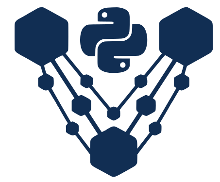

<p align="center">
  
</p>

<h1 align="center">VOrchestra</h1>

<p align="center">
  <strong>Local-first orchestration for Python virtual environments.</strong>
</p>

<p align="center">
  Discover, inspect, repair, audit, clean up, and operate Python environments from one native desktop app.
</p>

<p align="center">
  <a href="https://github.com/TI-com-Cafe/vorchestra/actions/workflows/ci.yml"></a>
  <a href="https://github.com/TI-com-Cafe/vorchestra/releases/tag/v0.1.1"></a>
  <a href="./LICENSE"></a>
  
  
</p>

<p align="center">
  <a href="https://ti-com-cafe.github.io/vorchestra/">Documentation</a>
  · <a href="https://github.com/TI-com-Cafe/vorchestra/releases/tag/v0.1.1">Download</a>
  · <a href="./ROADMAP.md">Roadmap</a>
  · <a href="./CONTRIBUTING.md">Contributing</a>
  · <a href="./CHANGELOG.md">Changelog</a>
</p>

---

## What It Is

VOrchestra is a native desktop control center for Python environments across local workspaces.

It is designed for developers who accumulate many `.venv` folders and need to answer practical questions quickly:

- Which environments exist on this machine?
- Which ones are broken, stale, huge, vulnerable, or drifting from lockfiles?
- What package changed, what depends on it, and how risky is the next install?
- How do I repair or rebuild this environment without freezing the UI?
- How do I keep project tooling, Docker, VS Code, Jupyter, scripts, security checks, and `.env` files aligned?

VOrchestra does not replace `pip`, `uv`, Pixi, Conda, VS Code, Docker, or Jupyter. It orchestrates them locally and gives you a single operational view.

## Current Release

`v0.1.1` is the current public release. `v0.1.0` was the first public release.

Download installers from:

https://github.com/TI-com-Cafe/vorchestra/releases/tag/v0.1.1

Release assets:

- Linux: `.AppImage`, `.deb`, and `.rpm`.
- Windows: `.msi` and `.exe` installer artifacts.
- macOS: `.dmg` builds for Apple Silicon and Intel.

The release workflow builds binaries for Linux, Windows, and macOS.

## Install And Uninstall

### Windows

Install with `VOrchestra_*_x64_en-US.msi` or `VOrchestra_*_x64-setup.exe`.

Uninstall:

- Open Windows Settings.
- Go to Apps, then Installed apps.
- Search for `VOrchestra`.
- Select Uninstall.

The MSI and setup EXE are native Windows installers, so VOrchestra should also appear in classic Control Panel uninstall flows.

### macOS

Install with the `.dmg` for your CPU architecture, then drag `VOrchestra.app` into Applications.

Uninstall:

- Quit VOrchestra.
- Delete `VOrchestra.app` from Applications.
- Optional data cleanup: remove `~/Library/Application Support/dev.vorchestra.app`.

### Linux

Install with the package format that matches your distro.

AppImage:

```bash
chmod +x VOrchestra*.AppImage
./VOrchestra*.AppImage
```

Uninstall AppImage:

```bash
rm ./VOrchestra*.AppImage
```

If you integrated the AppImage with a launcher tool, remove the generated desktop entry from your launcher tool as well.

Debian / Ubuntu:

```bash
sudo apt install ./VOrchestra*.deb
sudo apt remove vorchestra
```

Fedora / RHEL / openSUSE-style RPM:

```bash
sudo dnf install ./VOrchestra*.rpm
sudo dnf remove VOrchestra
```

Optional Linux data cleanup:

```bash
rm -rf ~/.local/share/dev.vorchestra.app
```

Uninstalling VOrchestra does not delete your workspaces or Python environments. Those are regular project folders on your machine.

## Documentation

The official documentation site is published at:

https://ti-com-cafe.github.io/vorchestra/

Useful local docs:

- [Architecture](./docs/ARCHITECTURE.md)
- [Command model](./docs/COMMANDS.md)
- [Background jobs](./docs/JOBS.md)
- [Developer notes](./docs/CONTRIBUTING_DEV.md)
- [Good first issues](./docs/GOOD_FIRST_ISSUES.md)
- [Language policy](./docs/LANGUAGE.md)
- [Release process](./RELEASE.md)
- [Roadmap](./ROADMAP.md)
- [Changelog](./CHANGELOG.md)

## Highlights

### Workspace Inventory

- Add multiple workspaces.
- Recursively scan for `.venv`, virtualenv, Conda, and Pixi environments.
- Cache inventory in local SQLite.
- Detect untracked environments and stale database entries.
- Remove stale entries when paths no longer exist.
- Keep expensive scans cancellable and off the UI thread.
- Configure scan depth with `VORCHESTRA_SCAN_MAX_DEPTH`.

### Environment Creation

- Create environments with `pip` or `uv`.
- Create from built-in templates based on real Python workflows.
- Create custom templates from existing environments.
- Create from project manifests such as `requirements.txt`, `pyproject.toml`, `Pipfile`, `setup.py`, and `setup.cfg`.
- Keep template builds and package installs as background jobs.
- Use local writable `UV_CACHE_DIR` for safer `uv` operations.

### Project-First Operations

- Group environments by project root.
- Detect project manifests and installable dependencies.
- Show project posture and best environment health.
- Run project-oriented `uv` workflows where supported.
- Surface next-best actions: scan, sync, repair, diagnostics, packages, lockfile, or project sync.

### Package Studio

- Search, sort, and filter installed packages.
- Install from PyPI, Test PyPI, Git, URL, local file, or local project.
- Preview install impact and compatibility before package changes.
- Detect editable installs and package provenance where metadata is available.
- Uninstall, update, export requirements, and inspect reverse dependencies.
- View dependency tree and graph with performance controls for large environments.
- Virtualized package and tree rendering for large package sets.

### Manager Support

- `pip`: package install, uninstall, update, freeze, diagnostics, lockfile restore, dependency tree helpers.
- `uv`: package operations through `uv pip`, project sync/lock/run/add/remove workflows where supported.
- Pixi: environment inventory plus native PyPI dependency writes through `pixi add/remove --pypi`.
- Conda: read-only inventory and native-manager guidance.

VOrchestra avoids mutating manager metadata where doing so would be unsafe or ambiguous.

### Health And Repair

- Environment Health Score.
- Repair Wizard with recommended actions.
- Install missing `pip` where safe.
- Install helper tools such as `pipdeptree` and `pip-audit` where supported.
- Rebuild broken environments from project sources.
- Preview rebuild source before destructive changes.
- Create project snapshots under `.vorchestra/snapshots` before risky operations.
- Restore project files and package freeze snapshots from the Repair tab.
- Export sanitized support bundles for bug reports.

### Diagnostics, Security, And Policy

- Diagnostics do not auto-run when opening the tab.
- Heavy checks run as cancellable background jobs.
- `pip check` / `uv pip check` consistency checks.
- Outdated package checks.
- `pip-audit` security scanning with install guidance when missing.
- Package metadata audit for licenses, missing metadata, deprecated/inactive hints, and suspicious package names.
- CycloneDX SBOM export.
- Optional `vorchestra.toml` policy engine for package denylist, suspicious names, missing license handling, denied licenses, and critical vulnerability enforcement.

### Disk Cleanup

- Cache summary by location.
- Safe purge of allow-listed cache directories.
- Duplicate wheel detection.
- Large and stale environment candidates.
- Missing environment entries.
- Cleanup guidance before destructive action.

### Project Tools

- Structured `.env` editor with `.env.example` / `.env.template` awareness.
- Secret-like value masking and raw edit mode.
- `pyvenv.cfg` viewer.
- Saved automation scripts.
- Quick tools such as pytest, ruff, black, and mypy.
- Open activated terminal.
- VS Code Interpreter Doctor.
- Generate VS Code settings.
- Register Jupyter kernels.
- Generate Docker files and run Docker build/run in a terminal.
- Install pre-commit hooks where supported.

### Local-First AI

- Optional Ollama integration for local environment explanation.
- Uses `http://127.0.0.1:11434` only.
- No cloud calls and no telemetry.
- If Ollama is unavailable, VOrchestra shows a local setup hint instead of failing the Studio.

## Privacy Model

VOrchestra is local-first by design.

- No telemetry.
- No analytics.
- No account required.
- No cloud sync.
- Metadata is stored locally through SQLite.
- Project files are written only when explicitly requested.
- Network is used only for workflows that inherently require it, such as PyPI search, package installs, advisory lookups, or local Ollama calls to `localhost`.

## Requirements

### Runtime

- Linux, Windows, or macOS.
- Python 3.x.
- `pip` strongly recommended.
- `uv` recommended for faster and more reproducible workflows.

Optional tools by feature:

- `pipdeptree`: dependency tree and graph for pip-style environments.
- `pip-audit`: security scans.
- Docker: Docker file generation and build/run workflow.
- Git: pre-commit setup and project workflows.
- VS Code CLI (`code`): editor integration.
- Jupyter + `ipykernel`: kernel registration.
- Pixi or Conda: native-manager inventory.
- Ollama: local AI explanation.

Common helper install:

```bash
python -m pip install --upgrade pip
python -m pip install pipdeptree pip-audit ipykernel pre-commit
```

Install `uv` on Unix-like systems:

```bash
curl -LsSf https://astral.sh/uv/install.sh | sh
```

Full runtime guidance:

https://ti-com-cafe.github.io/vorchestra/docs/start/requirements

### Linux Build Packages

On Debian/Ubuntu-like systems, Tauri/WebKit builds usually need:

```bash
sudo apt-get install -y \
  libwebkit2gtk-4.1-dev \
  libgtk-3-dev \
  libayatana-appindicator3-dev \
  librsvg2-dev \
  libsoup-3.0-dev \
  libjavascriptcoregtk-4.1-dev
```

Check the official Tauri prerequisites for your distribution if native builds fail.

## Build From Source

```bash
git clone https://github.com/TI-com-Cafe/vorchestra.git
cd vorchestra
npm install
npm run tauri dev
```

Frontend-only development:

```bash
npm run dev
```

Production build:

```bash
npm run tauri build
```

## Validation

Use targeted checks while developing:

```bash
npm run check:frontend
npm run test:frontend:product
npm run test:frontend:components
npm run test:frontend:hooks
npm run test:frontend:smoke
npm run check:rust
npm run test:rust
```

Rust-specific checks:

```bash
cd src-tauri
cargo fmt --all -- --check
cargo clippy --all-targets -- -D warnings
cargo test --all-targets
```

Full project check:

```bash
npm run check
```

## GitHub Action

This repo includes a composite action for CI environment checks:

```yaml
- uses: TI-com-Cafe/vorchestra/.github/actions/vorchestra-health-check@v0.1.1
  with:
    mode: all
    python: python
    requirements-file: requirements.txt
```

Modes:

- `health`: runs `pip check`.
- `security`: runs `pip check` and `pip-audit` when installed.
- `metadata`: prints package/license metadata summary.
- `all`: runs all checks.

## Configuration

`VORCHESTRA_SCAN_MAX_DEPTH`

Default: `16`.

Purpose: maximum workspace scan depth. Values are clamped to `3..64`.

### Project Policy

Optional project policy file:

```toml
# vorchestra.toml
[policy]
critical_vulnerabilities = "block"
unknown_license = "warn"
suspicious_packages = "warn"
deprecated_packages = "warn"

[policy.licenses]
deny = ["GPL", "AGPL"]

[policy.packages]
deny = ["bad-package"]
```

Policy is project-local. Missing config means no enforcement.

## Troubleshooting

### `database is locked`

Close other running VOrchestra instances and retry. VOrchestra retries transient locks, but another process can still hold SQLite open.

### `No module named pip`

Some environments are created without `pip`. VOrchestra uses manager-specific commands where possible. Use Repair to install missing `pip` only where safe.

### Dependency tree requires `pipdeptree`

Install it into the selected environment:

```bash
pip install pipdeptree
```

The Tree screen can install it directly or open a terminal with the command ready.

### Security scan requires `pip-audit`

For `pip`:

```bash
pip install pip-audit
```

For `uv`:

```bash
uv pip install --python "<venv>/bin/python" pip-audit
```

For Pixi:

```bash
pixi add pip-audit
```

### VS Code uses the wrong interpreter

Open Studio -> Repair or Project Tools and use VS Code Interpreter Doctor.

### Docker action fails

Confirm Docker is installed and running. Save generated manifests before using Build & Run.

### Local AI is unavailable

Start Ollama and install a model:

```bash
ollama pull llama3.2
```

VOrchestra will use local `localhost` Ollama only.

## Contributing

Contributions are welcome.

Start here:

- [CONTRIBUTING.md](./CONTRIBUTING.md)
- [Developer notes](./docs/CONTRIBUTING_DEV.md)
- [Good first issue candidates](./docs/GOOD_FIRST_ISSUES.md)
- [Architecture overview](./docs/ARCHITECTURE.md)
- [C4 model](./docs/C4_MODEL.md)

Recommended contribution areas:

- Package-manager support and command fakes.
- Backend parser tests and fixtures.
- UX improvements around long-running jobs.
- Policy engine rules.
- Local-first diagnostics and repair flows.
- Documentation and screenshots.

## Security

Please report vulnerabilities privately using GitHub Security Advisories. Do not open public issues for security reports.

## License

Apache-2.0. See [LICENSE](./LICENSE).

---

Built by Marco Antero.
