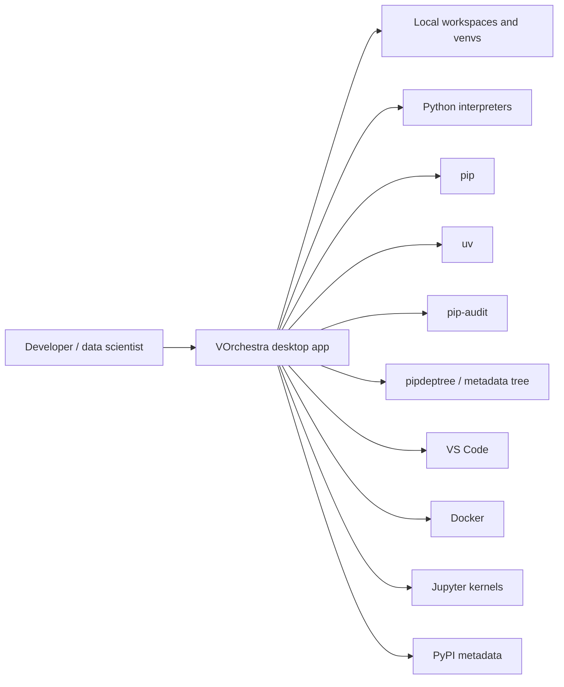
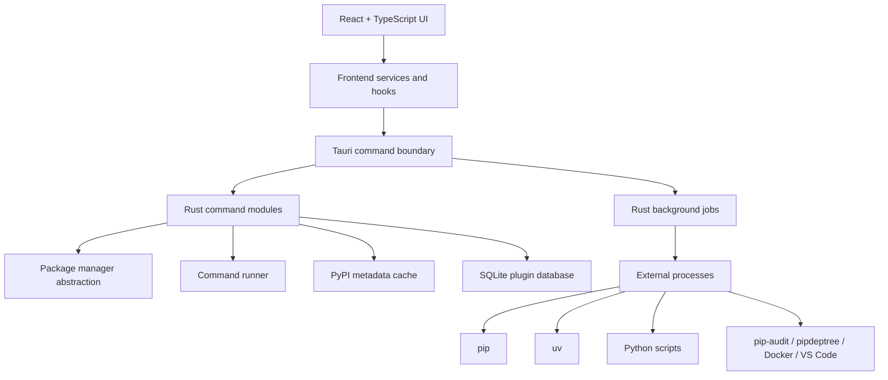
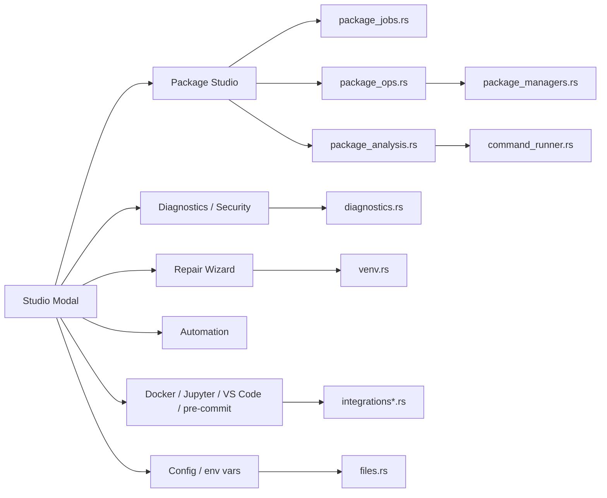
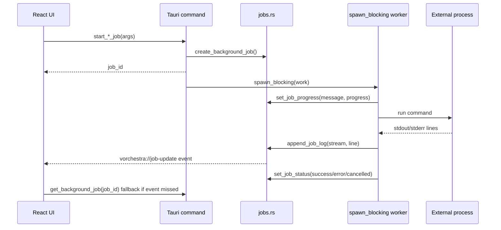
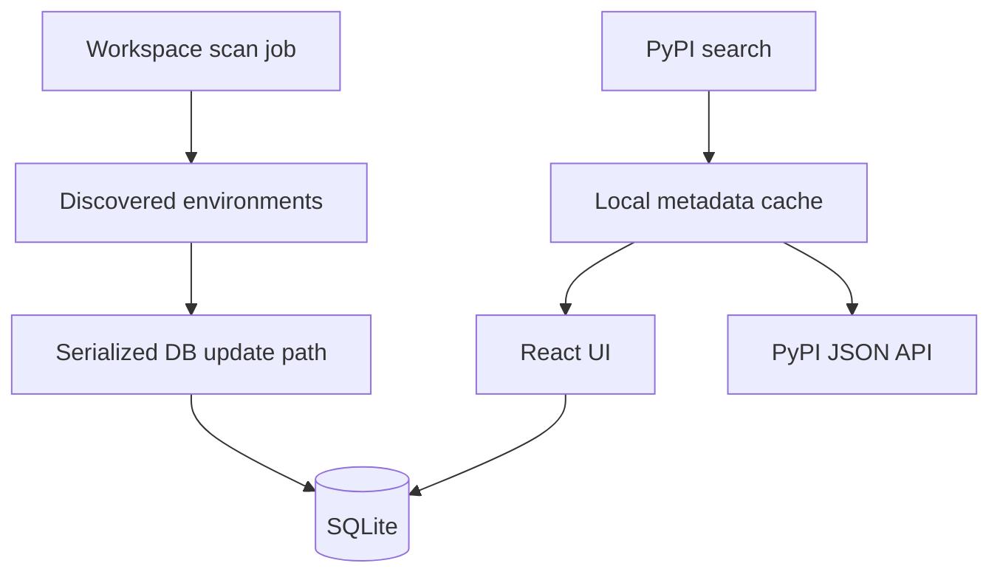

# C4 Model

This document describes VOrchestra using the C4 model. It is intentionally practical: it explains what contributors need to know before changing commands, jobs, package managers, or UI flows.

## Context

VOrchestra is a local-first desktop application for managing Python environments across workspaces. It does not replace `pip`, `uv`, Conda, Pixi, VS Code, Docker, or Jupyter. It coordinates them and gives the user inventory, diagnostics, repair, cleanup, security, and project context from one UI.



External network use is explicit and feature-driven. PyPI search, package installation, security audit, and metadata refresh may need network access. Workspace scanning, package inventory, size scans, tree rendering, local diagnostics, `.env` editing, VS Code doctor, and most repair flows are local.

## Containers



### React UI

- Owns visible state, tab state, forms, modals, filters, and confirmations.
- Subscribes to background job updates through Tauri events with snapshot fallback.
- Uses virtualization for large package lists and dependency trees.
- Avoids native `alert`, `prompt`, and `confirm` so state and styling stay controlled.

### Rust backend

- Owns filesystem access, environment discovery, package manager command construction, subprocess execution, SQLite interactions, and long-running jobs.
- Heavy work must use background jobs or `spawn_blocking`.
- Long commands should stream logs when the user benefits from seeing progress.

### SQLite

- Stores workspaces, venv records, scripts, custom templates, and lightweight metadata.
- Frontend writes are serialized where the UI owns the flow.
- Backend long scans should avoid writing stale results after cancellation or deletion.

### Package manager abstraction

- `src-tauri/src/package_managers.rs` centralizes command shapes for `pip` and `uv`.
- Conda remains read-only inventory; Pixi supports native PyPI dependency writes where safe.
- New managers should be added through this abstraction, not through scattered `engine == ...` branches.

### Command runner

- `src-tauri/src/command_runner.rs` is a narrow test seam for command-builder outputs.
- `RealCommandRunner` executes real commands.
- `FakeCommandRunner` enables deterministic tests for dry-run preview and package analysis without requiring host `pip` or `uv` behavior.

## Components



## Background Job Flow



Rules:

- Use jobs for scans, diagnostics, security checks, installs, updates, deletes, package sizes, dependency trees, Python installs, `uv sync`, lockfile restore, bundle import, and rebuild flows.
- Expose cancellation for flows that can take long enough to block user intent.
- Stream logs for install/update/uninstall, diagnostics, security audit, automation scripts, pre-commit, lockfile restore, bundle import, rebuild, clone restore, and template package installation.

## SQLite And Cache Flow



Rules:

- Do not let stale scan results recreate deleted venv entries.
- Prefer local cache fallback when network metadata fails and stale cached data exists.
- Keep cache TTL explicit. Current default is 24 hours for PyPI metadata.

## Adding A Package Manager

1. Add a manager implementation in `src-tauri/src/package_managers.rs`.
2. Implement common command builders: install, uninstall, update, freeze, check, outdated, requirements install, preview install, and preview upgrade.
3. Add command construction tests using a fake venv path.
4. Decide whether mutations are safe. If not, keep the manager read-only like Conda.
5. Update diagnostics, package tree, repair actions, and install hints only after the command builders are tested.
6. Add UI copy that explains what is editable and what remains native-manager-only.

## Testing Strategy

Use targeted validation first:

```bash
npm run test:frontend:smoke
npm run test:frontend:product
npm run check:frontend
cd src-tauri && CARGO_TARGET_DIR=/tmp/vorchestra-ci-target cargo clippy --lib -- -D warnings
cd src-tauri && CARGO_TARGET_DIR=/tmp/vorchestra-ci-target cargo test package_managers
cd src-tauri && CARGO_TARGET_DIR=/tmp/vorchestra-ci-target cargo test package_analysis
```

Run broader checks before release or large PRs:

```bash
npm run check
cd src-tauri && cargo test --all-targets
npm run tauri dev
```

