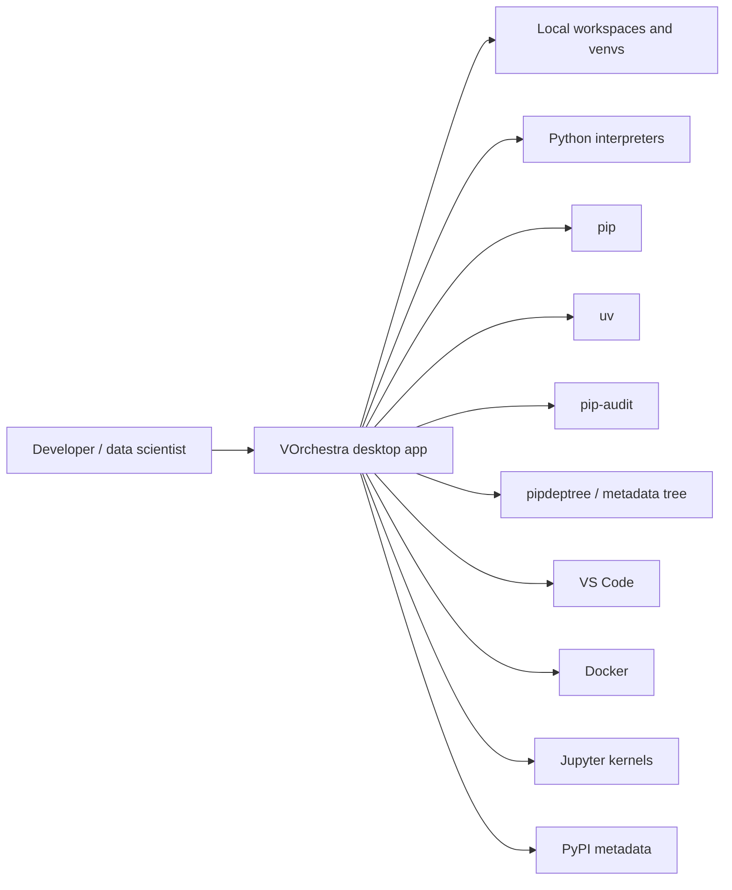
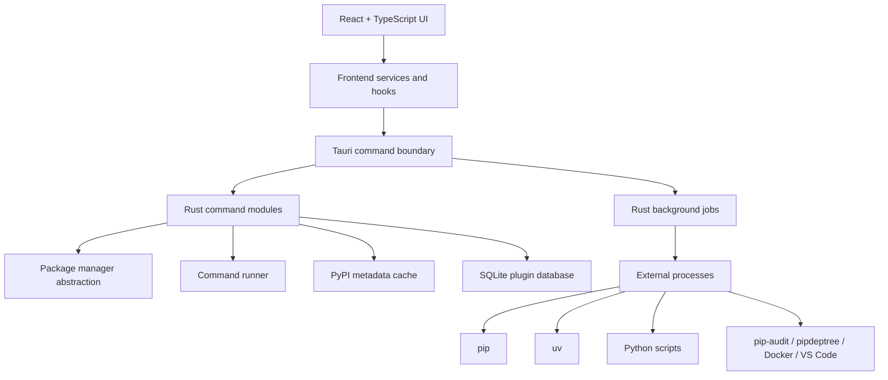
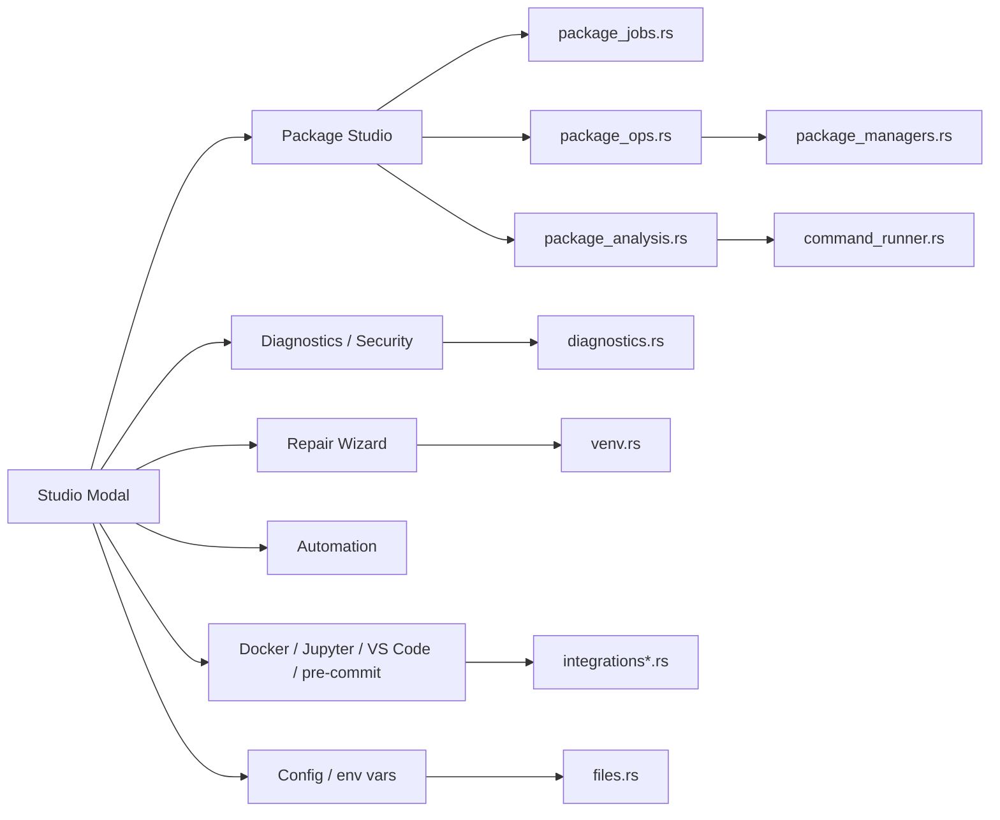
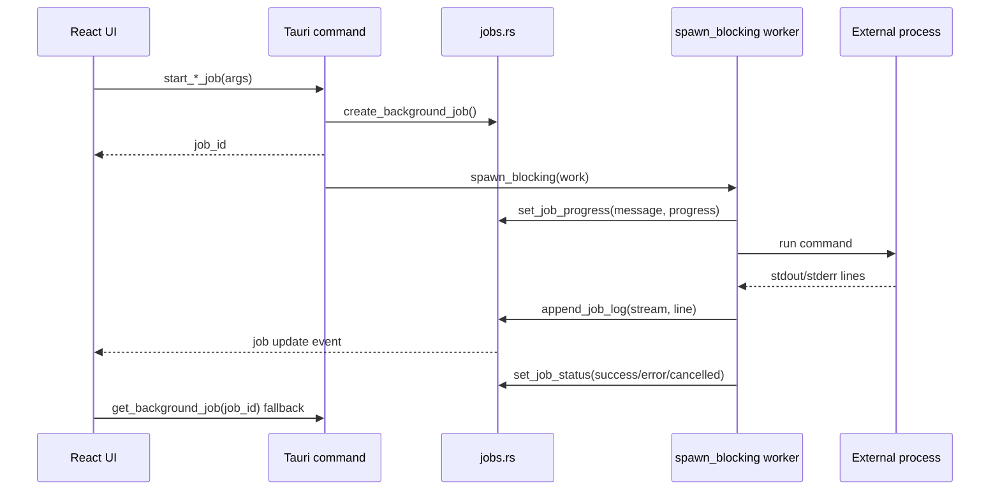
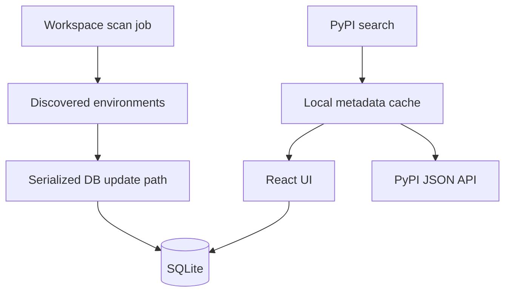

# C4 Model

VOrchestra is a local-first desktop application for managing Python environments across workspaces. It coordinates existing tools instead of replacing them.

## Context

Network use is explicit. PyPI search, package installation, security audit, and metadata refresh may need network access. Workspace scanning, inventory, local diagnostics, `.env` editing, VS Code doctor, and most repair flows are local.

## Containers

## Components

## Background Jobs

Use jobs for scans, diagnostics, security checks, installs, updates, deletes, package sizes, dependency trees, Python installs, `uv sync`, lockfile restore, bundle import, rebuild, and clone restore.

## SQLite And Cache

Do not let stale scan results recreate deleted venv entries. Prefer local cache fallback when network metadata fails and stale cached data exists.

## Adding A Package Manager

1. Add a manager implementation in `src-tauri/src/package_managers.rs`.
2. Implement command builders for install, uninstall, update, freeze, check, outdated, requirements install, preview install, and preview upgrade.
3. Add command construction tests using a fake venv path.
4. Decide whether mutations are safe. If not, keep the manager read-only like Conda/Pixi.
5. Update diagnostics, package tree, repair actions, and install hints only after command builders are tested.
6. Add UI copy that explains what is editable and what remains native-manager-only.
